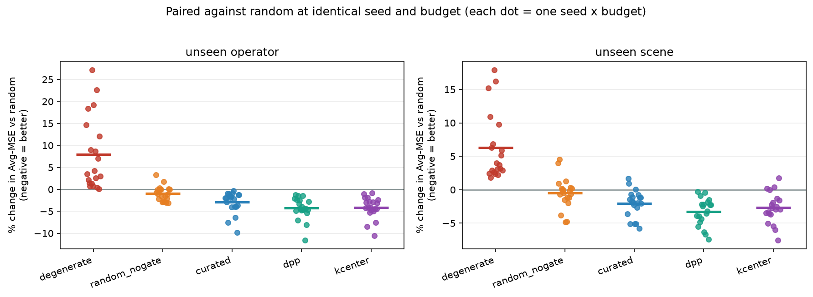

# EgoScore — A Curation Engine for EgoVerse

**EgoVerse Data Optimization & Evaluation Suite — Track 1: The Curation Engine**

> *Which episodes are worth training on?*

EgoVerse ships ~456k episodes. Not all of it helps. This repo picks a subset that does,
and — the part that actually matters — **measures whether the pick beat picking at random.**

---

## Result

| Selector | Paired wins vs random | Mean Avg-MSE change | Wilcoxon p |
|---|---|---|---|
| `dpp` (log-det diversity) | **40/40** | **−3.79%** | 2e−12 |
| `kcenter` | 36/40 | −3.42% | 2e−10 |
| `curated` (facility location) | 37/40 | −2.51% | 1e−09 |
| `random_nogate` (no quality gate) | 24/40 | −0.73% | n.s. |
| `degenerate` (**positive control**) | 0/40 | **+7.12%** | 2e−12 |

40 comparisons = 10 seeds × 2 budgets × 2 held-out axes. Every selector is compared to
`random` at the *same seed and budget*, on the *same* held-out windows.

**Selection matters here; filtering does not.** The quality gate is statistically
indistinguishable from no effect (sign test p = 0.27). It drops only 7 of 572 episodes,
and on data this clean there is nothing for filtering to bite on. We report this because
it reverses the conclusion we drew at 3 seeds, where the gate looked worth about a percent.

**The honest headline is not "throw away 75% of your data for free."** Training on the
full gated pool still beats every subset. It is:

> At a quarter of the budget, diversity-aware selection closes **52%** (unseen operator)
> and **50%** (unseen scene) of the gap between a random quarter and using everything.

🧭 **[Interactive demo — The Curation Manifold](https://claude.ai/code/artifact/0db5ec63-9657-4738-854a-2703290324cc)** · 📊 **[Slide deck](https://claude.ai/code/artifact/f9b606c2-ad6d-488b-ab9f-727c9875e1f8)** · 📄 **[Validation report](reports/validation.md)**

In the demo you can switch selectors and watch which quarter of the data each one keeps.
`degenerate` visibly clumps into 21 operator×scene groups; `kcenter` spreads across 104.
That difference is the whole thesis, and it is what the Avg-MSE gap prices.



---

## Why the positive control is the most important row

A 3% margin on a proxy metric over a few hundred episodes is easy to disbelieve, and the
obvious failure mode is a harness too noisy to detect anything at all.

So we included a condition that *should* lose, for a reason established independently by
the EgoVerse paper: demonstrator and scene diversity improve generalization.
`degenerate` spends the identical budget but concentrates it into ~21 operator × scene
groups instead of ~73. It loses **0/40 at +7.12%** — large, unambiguous, correctly signed.

That is what makes the smaller curated-vs-random margin a measurement rather than noise.
The control also *weakens* at the larger budget, exactly as it should — at half the pool
you cannot concentrate the budget much. A control that stayed flat would have been
suspicious.

---

## Method

**Slice.** `fold_clothes`, `lab=rl2`, `human_bimanual` — 572 episodes, 20 operators,
16 scenes. This is the **only** slice in EgoVerse with a populated operator × scene grid:
`microagi` (9,896 fold_clothes episodes) carries no operator or scene metadata at all,
and `mecka` has 2 scenes. Without that grid neither held-out axis is constructible.

**Pipeline.**

```
episode table (Postgres)
      │
      ├─ quality gate ──────► deterministic rules, every drop carries a reason
      │
      ├─ episode embedding ─► 41 trajectory/keypoint features, whitened
      │
      └─ selection ─────────► facility location (1−1/e greedy guarantee),
                              DPP log-det, k-center, random, degenerate
                                        │
                                        ▼
                         train identical ridge action-chunk policy
                         on each subset → compare offline Avg-MSE on
                         held-out unseen operators / unseen scenes
```

**Proxy metric.** Offline Avg-MSE, the metric the EgoVerse authors use themselves:
10 frames of proprioceptive history → 30-step future bimanual EE pose chunk, predicted
*relative to the current pose* so the model cannot win by memorising room coordinates.
Random Fourier features + closed-form ridge, so the fit is exact and seed-independent —
any difference between conditions comes from the data, not from optimiser noise.

**Statistics.** Absolute Avg-MSE swings across seeds because each seed draws a different
held-out split, shifting every condition at once. Raw means with across-seed error bars
would understate the effect. All conditions within a seed see an identical split and
identical eval windows, so we report **paired** differences.

---

## Four things we found in the data

**We deleted a rule we could not prove.** An earlier gate projected hand keypoints into the
camera image and flagged "hands out of frame", dropping 23 episodes. Rendering those frames
showed hands in plain view in every one. We tried two projection models — keypoints as
camera-frame points, and keypoints transformed by the head pose first — and under both,
**zero of 42 keypoints** land inside the image on frames where the hands are obviously
visible (`scripts/22_projection_check.py`). Rather than guess a third time we removed the
rule. The six surviving rules use durations, distances and NaN counts only, touch no camera
geometry, and therefore compare cleanly across labs.

**Episode segmentation is wildly inconsistent between labs, and the gate can see it.**
`rl2` drops 1 episode in 572. `mecka` drops 1.2%. `microagi` — the largest fold_clothes
slice at 9,896 episodes — drops **13.9%**, all of them recordings running more than 3× that
lab's median episode length. One in seven "episodes" there is a whole folding session rather
than a single demonstration.

**Zarr arrays are zero-padded to a chunk boundary.** The true length is `total_frames` in
the group attrs. Read the raw array without truncating and you get a run of identical
trailing frames that looks exactly like a frozen tracker. Our frozen-tracker count is
zero *because* we truncate — without that step it would have been near 100% and the gate
would have discarded the entire dataset.

**Images cost 84.6 GB for this slice; pose arrays cost 2.3 GB.** So every signal here is
derived from poses and keypoints alone. That was a deliberate constraint, not a
shortcut: a curation engine that costs more to run than the training it is supposed to
save is not worth running.

**An "episode" is not a common unit across labs.** Median episode duration is **93 s in
`rl2`** and **6.6 s in `mecka`** — a factor of ~14. `rl2` episodes are long multi-fold
sessions; `mecka` episodes are short single-action clips. Anyone budgeting curation in
episode counts across labs is comparing incommensurable units: a subset of "1,000
episodes" means wildly different things depending on where it came from. Budgeting in
frames or seconds is the safer default.

Both labs are clean on tracking dropout and frozen trackers — **0.0% in each**. That is a
real finding about EgoVerse, not a null result: the pose pipelines are solid, and a gate
built around imagined tracking failures would find nothing to do.

---

## Limitations

Stated up front, because they are the first things worth attacking.

1. **Avg-MSE is a proxy, not robot success.** The EgoVerse authors use it while saying so:
   *"this metric does not directly measure downstream robot performance [but] provides a
   stable signal for comparing generalization."* We adopt it on exactly those terms.
2. **The proxy policy is proprioceptive, not visual** — a consequence of the 84.6 GB
   figure above. A visual policy might rank subsets differently.
3. **One task, one lab.** No claim of transfer across tasks. The slice was forced by
   metadata availability, not chosen for favourability.
4. **Small effect, small pool.** ~4% on a few hundred episodes. The positive control is
   what makes it interpretable rather than decorative.
5. **The one gate rule that still fires, we cannot validate.** "Hands out of frame" matters
   for a policy that consumes pixels. Ours does not, and the hand *pose* stays valid when a
   hand leaves the RGB frame (Aria tracks hands from its SLAM cameras). So our own metric
   cannot tell us whether that rule earns its place.
6. **Facility location was our a priori pick and it lost.** `dpp` and `kcenter` both beat
   it. We report that rather than quietly promoting the winner to headline method: on
   this slice *spread* seems to matter slightly more than *coverage*. `dpp` is cleanly
   ahead of `curated`, but `dpp` and `kcenter` are within noise of each other.

---

## Deliverables

| | |
|---|---|
| Keep/drop recommendations | [`reports/keep_drop.csv`](reports/keep_drop.csv) — per-episode, with reason |
| Gate audit | [`reports/gate_audit.csv`](reports/gate_audit.csv) — per-rule prevalence |
| Cross-lab audit | [`reports/cross_lab_summary.csv`](reports/cross_lab_summary.csv) — rl2 vs mecka |
| Validation report | [`reports/validation.md`](reports/validation.md) |
| Summary slide | [`reports/egoscore_summary_slide.png`](reports/egoscore_summary_slide.png) · [PDF](reports/egoscore_summary_slide.pdf) |
| Raw results | [`reports/results.csv`](reports/results.csv), [`reports/paired_deltas.csv`](reports/paired_deltas.csv) |
| Figures | [`reports/figs/`](reports/figs) |

## Reproducing

The EgoVerse README publishes read-only AWS keys for public dataset access. Put them in
`~/.egoverse_aws_credentials` in aws-credentials format, then:

```bash
bash scripts/run_all.sh
```

Runtime ≈ 15 minutes, dominated by the 1.2 GB pose pull.

## Layout

```
egoscore/
  access.py     Postgres + R2 access (no torch dependency)
  features.py   quality signals + embedding features from poses
  gate.py       the quality gate and its audit table
  select.py     random / facility-location / DPP / k-center / degenerate
  proxy.py      ridge action-chunk policy and Avg-MSE
scripts/        01..10, run in order; run_all.sh does the whole thing
reports/        outputs, figures, validation report
```

## License

MIT
