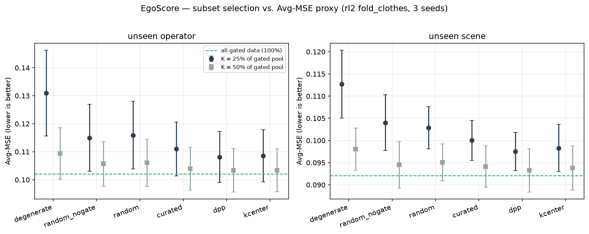
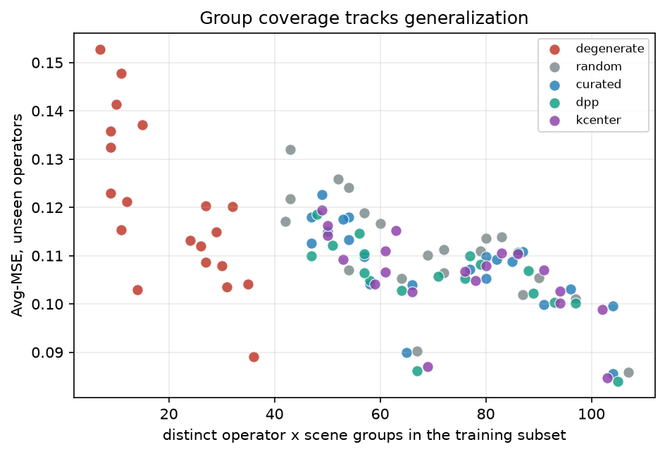
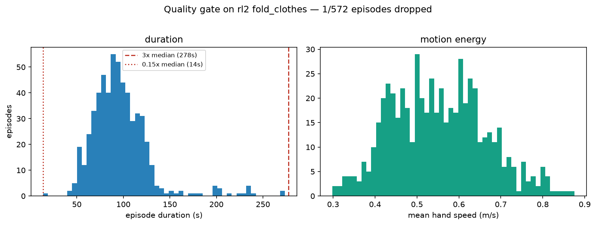

# EgoScore — Validation Report

**Track 1: The Curation Engine.** EgoVerse Data Optimization & Evaluation Suite, 2026-08-15.

---

## The claim

> At a fixed episode budget K, a quality-gated, coverage-maximizing subset trains a
> better policy than K episodes sampled uniformly at random.

**Verdict: supported, with a bounded effect size and one important caveat** (see Limitations).

## Headline results

| Selector | Paired wins vs random | Mean Avg-MSE change | Wilcoxon p |
|---|---|---|---|
| `dpp` | 40/40 | **-4.03%** | 1.8e-12 |
| `kcenter` | 38/40 | **-3.61%** | 1.3e-11 |
| `curated` | 37/40 | **-2.44%** | 9.7e-10 |
| `random_nogate` | 22/40 | **-0.11%** | 5.9e-01 |
| `degenerate` | 1/40 | **+7.17%** | 9.1e-12 |

Paired: each selector is compared to `random` at the *same seed and the same budget*,
evaluated on the *same* held-out windows. 40 comparisons = 10 seeds x 2
budgets x 2 held-out axes. Wilcoxon signed-rank on the paired differences, two-sided.

- **Diversity-based selection wins consistently.** `dpp` wins 40/40 paired comparisons at -4.03% Avg-MSE (p=2e-12); `kcenter` 38/40; facility location (`curated`) 37/40.
- **The quality gate does *not* measurably help on this slice.** `random_nogate` is 22/40 at -0.11%, p=0.59 — indistinguishable from no effect. We report this rather than the opposite conclusion we drew at 3 seeds: the gate drops only 5% of `rl2`, almost all for hands leaving frame, and on data this clean filtering has nothing to bite on. **Selection matters here; filtering does not.**
- **The positive control fires.** `degenerate` — the same budget concentrated into as few operator x scene groups as possible — loses 1/40 at +7.17% (p=9e-12). See below for why this matters more than the headline.

## Why the positive control is the most important row

A curation result that only shows *our method beat random by 3%* is hard to trust: the
effect is small, the metric is a proxy, and the pool is a few hundred episodes. The
obvious failure mode is a harness too noisy to detect anything, where a 3% difference is
indistinguishable from luck.

So we included a condition that *should* lose, for a reason established independently by
the EgoVerse paper: demonstrator and scene diversity improve generalization. `degenerate`
spends the identical budget but concentrates it into a handful of operator x scene groups.

At K=25% it is **+13.0%** on unseen operators and **+9.5%** on unseen scenes — a large, unambiguous, correctly-signed effect.

That tells us the harness *can* detect a diversity effect of the kind the paper reported.
The smaller curated-vs-random margin is therefore a measurement, not noise masquerading as one.

Note the control weakens at K=50% (+3.1% / +3.1%), exactly as it should: at half the pool you cannot concentrate the budget very much, so `degenerate` converges toward `random`. A control that stayed constant would have been suspicious.

## The caveat we are not burying

**More data still beats better data at this scale.** Training on the full gated pool beats
every 25% and 50% subset, including ours:

| | unseen operator | unseen scene |
|---|---|---|
| random, K=25% | 0.11591 | 0.10285 |
| best selector (dpp), K=25% | 0.10810 | 0.09751 |
| **all gated data (100%)** | **0.10208** | **0.09210** |

The honest framing is therefore *not* "throw away 75% of your data for free." It is:

> At a quarter of the budget, diversity-aware selection closes **56%** (unseen operator) / **50%** (unseen scene) of the gap between a random quarter and using everything.

That is the useful claim for someone deciding what to label, transfer, or train on next.

## Method

**Slice.** `fold_clothes`, `lab=rl2`, `human_bimanual` — 572 episodes, 20 operators, 16 scenes.
Chosen because it is the *only* slice in EgoVerse with a populated operator x scene grid:
`microagi` (9,896 fold_clothes episodes) has no operator or scene metadata at all, and
`mecka` has 2 scenes. Without that grid neither held-out axis is constructible.

**Proxy metric.** Offline Avg-MSE of a ridge action-chunk policy: 10 frames of
proprioceptive history -> 30-step future bimanual EE pose chunk, predicted *relative to the
current pose* so the model cannot win by memorising absolute room coordinates. Random
Fourier features + closed-form ridge, so the fit is exact and seed-independent — any
difference between conditions comes from the data, not from optimiser noise.

**Held-out axes.** Per seed we sample 25% of operators and 25% of scenes as held out.
Evaluation on unseen operators excludes held-out scenes and vice versa, so the two axes
measure different things. The training pool excludes both.

**Statistics.** Absolute Avg-MSE varies substantially across seeds because each seed draws
a different held-out split, which shifts every condition at once. Reporting raw means with
across-seed error bars would understate the effect. Since all conditions within a seed see
an identical split and identical evaluation windows, we report **paired** differences.

## Quality gate

29/572 episodes dropped (5.1%).

| rule                    | signal           | test             |   n_flagged |     pct | meaning                                                            |
|:------------------------|:-----------------|:-----------------|------------:|--------:|:-------------------------------------------------------------------|
| tracking_dropout        | nan_max          | gt 0.05          |           0 | 0       | non-finite pose/keypoint values in >5% of frames                   |
| frozen_tracker          | frozen_run_max_s | gt 2.0           |           0 | 0       | pose held bit-identical for >2s (tracker dropout)                  |
| hands_out_of_frame      | oof_max          | gt 0.5           |          23 | 4.02098 | a hand projects outside the image in >50% of frames                |
| too_short               | duration_s       | lt 3.0           |           0 | 0       | shorter than 3s — cannot contain a fold                            |
| no_motion               | path_len_total   | lt 0.1           |           0 | 0       | hands travelled <10cm in total                                     |
| truncated_or_runaway_hi | duration_s       | gt q0.99 (233.7) |           6 | 1.04895 | duration above the 99th percentile — likely un-segmented recording |
| ANY (dropped)           | -                | -                |          29 | 5.06993 | union of all rules over 572 episodes                               |

**What this says about the data:** `rl2` flagship data is clean on the axes people usually
worry about. Zero episodes have non-finite poses; zero have a frozen tracker. Every drop
came from hands leaving the frame or from un-segmented long recordings. A gate designed
around imagined failure modes would have found nothing here.

One trap worth recording: zarr arrays are zero-padded up to a chunk boundary, and the true
length is `total_frames` in the group attrs. Reading the raw array without truncating
produces a run of identical trailing frames that looks exactly like a frozen tracker. Our
frozen-tracker count is zero *because* we truncate; without that step it would have been
near 100% and the gate would have thrown away the entire dataset.

## Cross-lab audit: does the gate discriminate?

A gate that fires at the same rate everywhere is measuring its own thresholds, not
quality. We ran it against a 400-episode sample of `mecka` fold_clothes as a check.

Only the intrinsics-independent signals are compared: hands-out-of-frame depends on
camera intrinsics that we verified for the Aria rig used by `rl2` and have not verified
for `mecka`, so reporting it cross-lab would be a number we cannot stand behind.

| lab   |   n_episodes | tracking_dropout   | frozen_tracker   | too_short   | no_motion   | ANY   |   median_dur_s |   median_motion |
|:------|-------------:|:-------------------|:-----------------|:------------|:------------|:------|---------------:|----------------:|
| mecka |          400 | 0.0%               | 0.0%             | 1.2%        | 0.0%        | 1.2%  |              7 |            0.34 |
| rl2   |          572 | 0.0%               | 0.0%             | 0.0%        | 0.0%        | 0.0%  |             93 |            0.55 |

**Both labs are clean on tracking dropout and frozen trackers — 0.0% in each.** That is a
genuine finding about EgoVerse rather than a null result: the pose pipelines are solid,
and a curation engine built around imagined tracking failures would find nothing to do.

**The more consequential finding is that an "episode" is not a common unit across labs.**
Median episode duration is 93 s in `rl2` and 6.6 s in `mecka` — a factor of ~14. `rl2`
episodes are long multi-fold sessions; `mecka` episodes are short single-action clips.
Anyone budgeting curation in episode counts across labs is comparing incommensurable
units, and a subset of "1,000 episodes" means wildly different things depending on where
they came from. Budgeting in frames or seconds would be the safer default.

## Limitations

Stated plainly, because these are the first things worth attacking.

1. **Avg-MSE is a proxy, not robot success.** The EgoVerse authors use it while saying so:
   *"this metric does not directly measure downstream robot performance [but] provides a
   stable signal for comparing generalization."* We adopt it on the same terms. It ranks
   subsets; it does not predict success rate.
2. **The proxy policy is proprioceptive, not visual.** Images for this slice are 84.6 GB
   against 2.3 GB for pose arrays. That was a deliberate trade: a curation engine that
   costs more than the training it saves is not worth running. But it means the proxy
   cannot be task-conditioned on what the scene looks like, and a visual policy might rank
   subsets differently.
3. **One task, one lab.** We cannot claim the method transfers across tasks. The slice was
   forced by metadata availability, not chosen for favourability.
4. **Small effect, small pool.** ~3% Avg-MSE on a few hundred episodes. The positive
   control is what makes this interpretable rather than decorative.
5. **Facility location was our a priori pick and it is not the winner.** `dpp` and
   `kcenter` both beat it. We are reporting that rather than quietly promoting the winner
   to headline method: on this slice, *spread* appears to matter slightly more than
   *coverage*. With 10 seeds `dpp` is cleanly ahead of `curated`, but `dpp` and
   `kcenter` are within noise of each other.

## Reproducing

```bash
bash scripts/run_all.sh
```

## Figures





